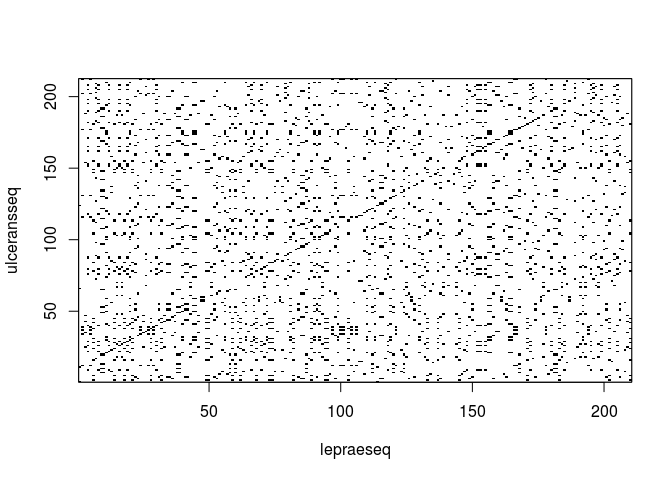
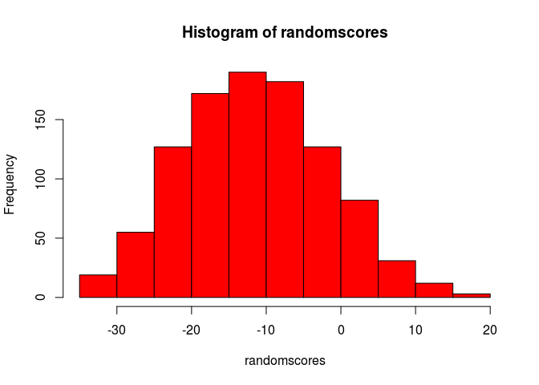

Pairwise\_Sequence\_Alignment
================

``` r
# reading in the sequences (assuming you've downloaded them)
library("seqinr")
# print working directory
print(getwd())
```

    ## [1] "/media/david/Linux/R_for_Bioinformatics/Pairwise_Sequence_Alignment"

``` r
# read in the protein fasta files
leprae <- read.fasta(file = "Q9CD83.fasta")
ulcerans <- read.fasta(file = "A0PQ23.fasta")
# get ONLY the protein sequence component of the files
lepraeseq <- leprae[[1]]
ulceransseq <- ulcerans[[1]]
# print the file sequences
lepraeseq
```

    ##   [1] "m" "t" "n" "r" "t" "l" "s" "r" "e" "e" "i" "r" "k" "l" "d" "r" "d"
    ##  [18] "l" "r" "i" "l" "v" "a" "t" "n" "g" "t" "l" "t" "r" "v" "l" "n" "v"
    ##  [35] "v" "a" "n" "e" "e" "i" "v" "v" "d" "i" "i" "n" "q" "q" "l" "l" "d"
    ##  [52] "v" "a" "p" "k" "i" "p" "e" "l" "e" "n" "l" "k" "i" "g" "r" "i" "l"
    ##  [69] "q" "r" "d" "i" "l" "l" "k" "g" "q" "k" "s" "g" "i" "l" "f" "v" "a"
    ##  [86] "a" "e" "s" "l" "i" "v" "i" "d" "l" "l" "p" "t" "a" "i" "t" "t" "y"
    ## [103] "l" "t" "k" "t" "h" "h" "p" "i" "g" "e" "i" "m" "a" "a" "s" "r" "i"
    ## [120] "e" "t" "y" "k" "e" "d" "a" "q" "v" "w" "i" "g" "d" "l" "p" "c" "w"
    ## [137] "l" "a" "d" "y" "g" "y" "w" "d" "l" "p" "k" "r" "a" "v" "g" "r" "r"
    ## [154] "y" "r" "i" "i" "a" "g" "g" "q" "p" "v" "i" "i" "t" "t" "e" "y" "f"
    ## [171] "l" "r" "s" "v" "f" "q" "d" "t" "p" "r" "e" "e" "l" "d" "r" "c" "q"
    ## [188] "y" "s" "n" "d" "i" "d" "t" "r" "s" "g" "d" "r" "f" "v" "l" "h" "g"
    ## [205] "r" "v" "f" "k" "n" "l"
    ## attr(,"name")
    ## [1] "sp|Q9CD83|PHBS_MYCLE"
    ## attr(,"Annot")
    ## [1] ">sp|Q9CD83|PHBS_MYCLE Chorismate pyruvate-lyase OS=Mycobacterium leprae (strain TN) OX=272631 GN=ML0133 PE=3 SV=1"
    ## attr(,"class")
    ## [1] "SeqFastadna"

``` r
ulceransseq
```

    ##   [1] "m" "l" "a" "v" "l" "p" "e" "k" "r" "e" "m" "t" "e" "c" "h" "l" "s"
    ##  [18] "d" "e" "e" "i" "r" "k" "l" "n" "r" "d" "l" "r" "i" "l" "i" "a" "t"
    ##  [35] "n" "g" "t" "l" "t" "r" "i" "l" "n" "v" "l" "a" "n" "d" "e" "i" "v"
    ##  [52] "v" "e" "i" "v" "k" "q" "q" "i" "q" "d" "a" "a" "p" "e" "m" "d" "g"
    ##  [69] "c" "d" "h" "s" "s" "i" "g" "r" "v" "l" "r" "r" "d" "i" "v" "l" "k"
    ##  [86] "g" "r" "r" "s" "g" "i" "p" "f" "v" "a" "a" "e" "s" "f" "i" "a" "i"
    ## [103] "d" "l" "l" "p" "p" "e" "i" "v" "a" "s" "l" "l" "e" "t" "h" "r" "p"
    ## [120] "i" "g" "e" "v" "m" "a" "a" "s" "c" "i" "e" "t" "f" "k" "e" "e" "a"
    ## [137] "k" "v" "w" "a" "g" "e" "s" "p" "a" "w" "l" "e" "l" "d" "r" "r" "r"
    ## [154] "n" "l" "p" "p" "k" "v" "v" "g" "r" "q" "y" "r" "v" "i" "a" "e" "g"
    ## [171] "r" "p" "v" "i" "i" "i" "t" "e" "y" "f" "l" "r" "s" "v" "f" "e" "d"
    ## [188] "n" "s" "r" "e" "e" "p" "i" "r" "h" "q" "r" "s" "v" "g" "t" "s" "a"
    ## [205] "r" "s" "g" "r" "s" "i" "c" "t"
    ## attr(,"name")
    ## [1] "tr|A0PQ23|A0PQ23_MYCUA"
    ## attr(,"Annot")
    ## [1] ">tr|A0PQ23|A0PQ23_MYCUA Chorismate pyruvate-lyase OS=Mycobacterium ulcerans (strain Agy99) OX=362242 GN=MUL_2003 PE=4 SV=1"
    ## attr(,"class")
    ## [1] "SeqFastadna"

``` r
# getting the sequences with seqinr package
library("seqinr")
choosebank("swissprot")
leprae <- query("leprae", "AC=Q9CD83")
lepraeseq <- getSequence(leprae$req[[1]])
ulcerans <- query("ulcerans", "AC=A0PQ23")
ulceransseq <- getSequence(ulcerans$req[[1]])
closebank()
lepraeseq
```

    ##   [1] "M" "T" "N" "R" "T" "L" "S" "R" "E" "E" "I" "R" "K" "L" "D" "R" "D"
    ##  [18] "L" "R" "I" "L" "V" "A" "T" "N" "G" "T" "L" "T" "R" "V" "L" "N" "V"
    ##  [35] "V" "A" "N" "E" "E" "I" "V" "V" "D" "I" "I" "N" "Q" "Q" "L" "L" "D"
    ##  [52] "V" "A" "P" "K" "I" "P" "E" "L" "E" "N" "L" "K" "I" "G" "R" "I" "L"
    ##  [69] "Q" "R" "D" "I" "L" "L" "K" "G" "Q" "K" "S" "G" "I" "L" "F" "V" "A"
    ##  [86] "A" "E" "S" "L" "I" "V" "I" "D" "L" "L" "P" "T" "A" "I" "T" "T" "Y"
    ## [103] "L" "T" "K" "T" "H" "H" "P" "I" "G" "E" "I" "M" "A" "A" "S" "R" "I"
    ## [120] "E" "T" "Y" "K" "E" "D" "A" "Q" "V" "W" "I" "G" "D" "L" "P" "C" "W"
    ## [137] "L" "A" "D" "Y" "G" "Y" "W" "D" "L" "P" "K" "R" "A" "V" "G" "R" "R"
    ## [154] "Y" "R" "I" "I" "A" "G" "G" "Q" "P" "V" "I" "I" "T" "T" "E" "Y" "F"
    ## [171] "L" "R" "S" "V" "F" "Q" "D" "T" "P" "R" "E" "E" "L" "D" "R" "C" "Q"
    ## [188] "Y" "S" "N" "D" "I" "D" "T" "R" "S" "G" "D" "R" "F" "V" "L" "H" "G"
    ## [205] "R" "V" "F" "K" "N" "L"

``` r
ulceransseq
```

    ##   [1] "M" "L" "A" "V" "L" "P" "E" "K" "R" "E" "M" "T" "E" "C" "H" "L" "S"
    ##  [18] "D" "E" "E" "I" "R" "K" "L" "N" "R" "D" "L" "R" "I" "L" "I" "A" "T"
    ##  [35] "N" "G" "T" "L" "T" "R" "I" "L" "N" "V" "L" "A" "N" "D" "E" "I" "V"
    ##  [52] "V" "E" "I" "V" "K" "Q" "Q" "I" "Q" "D" "A" "A" "P" "E" "M" "D" "G"
    ##  [69] "C" "D" "H" "S" "S" "I" "G" "R" "V" "L" "R" "R" "D" "I" "V" "L" "K"
    ##  [86] "G" "R" "R" "S" "G" "I" "P" "F" "V" "A" "A" "E" "S" "F" "I" "A" "I"
    ## [103] "D" "L" "L" "P" "P" "E" "I" "V" "A" "S" "L" "L" "E" "T" "H" "R" "P"
    ## [120] "I" "G" "E" "V" "M" "A" "A" "S" "C" "I" "E" "T" "F" "K" "E" "E" "A"
    ## [137] "K" "V" "W" "A" "G" "E" "S" "P" "A" "W" "L" "E" "L" "D" "R" "R" "R"
    ## [154] "N" "L" "P" "P" "K" "V" "V" "G" "R" "Q" "Y" "R" "V" "I" "A" "E" "G"
    ## [171] "R" "P" "V" "I" "I" "I" "T" "E" "Y" "F" "L" "R" "S" "V" "F" "E" "D"
    ## [188] "N" "S" "R" "E" "E" "P" "I" "R" "H" "Q" "R" "S" "V" "G" "T" "S" "A"
    ## [205] "R" "S" "G" "R" "S" "I" "C" "T"

``` r
# creating a dotPlot of the protein sequence overlap
dotPlot(lepraeseq, ulceransseq)
```



``` r
# create a scoring matrix for proteins
source("https://bioconductor.org/biocLite.R")
```

    ## Bioconductor version 3.6 (BiocInstaller 1.28.0), ?biocLite for help

    ## A new version of Bioconductor is available after installing the most
    ##   recent version of R; see http://bioconductor.org/install

``` r
biocLite("Biostrings")
```

    ## BioC_mirror: https://bioconductor.org

    ## Using Bioconductor 3.6 (BiocInstaller 1.28.0), R 3.4.4 (2018-03-15).

    ## Installing package(s) 'Biostrings'

    ## installation path not writeable, unable to update packages: codetools,
    ##   foreign, lattice, spatial

``` r
library(Biostrings)
```

    ## Loading required package: BiocGenerics

    ## Loading required package: parallel

    ## 
    ## Attaching package: 'BiocGenerics'

    ## The following objects are masked from 'package:parallel':
    ## 
    ##     clusterApply, clusterApplyLB, clusterCall, clusterEvalQ,
    ##     clusterExport, clusterMap, parApply, parCapply, parLapply,
    ##     parLapplyLB, parRapply, parSapply, parSapplyLB

    ## The following objects are masked from 'package:stats':
    ## 
    ##     IQR, mad, sd, var, xtabs

    ## The following objects are masked from 'package:base':
    ## 
    ##     anyDuplicated, append, as.data.frame, cbind, colMeans,
    ##     colnames, colSums, do.call, duplicated, eval, evalq, Filter,
    ##     Find, get, grep, grepl, intersect, is.unsorted, lapply,
    ##     lengths, Map, mapply, match, mget, order, paste, pmax,
    ##     pmax.int, pmin, pmin.int, Position, rank, rbind, Reduce,
    ##     rowMeans, rownames, rowSums, sapply, setdiff, sort, table,
    ##     tapply, union, unique, unsplit, which, which.max, which.min

    ## Loading required package: S4Vectors

    ## Loading required package: stats4

    ## 
    ## Attaching package: 'S4Vectors'

    ## The following object is masked from 'package:base':
    ## 
    ##     expand.grid

    ## Loading required package: IRanges

    ## Loading required package: XVector

    ## 
    ## Attaching package: 'Biostrings'

    ## The following object is masked from 'package:seqinr':
    ## 
    ##     translate

    ## The following object is masked from 'package:base':
    ## 
    ##     strsplit

``` r
sigma <- nucleotideSubstitutionMatrix(match = 2, mismatch = -1, baseOnly = TRUE)
sigma
```

    ##    A  C  G  T
    ## A  2 -1 -1 -1
    ## C -1  2 -1 -1
    ## G -1 -1  2 -1
    ## T -1 -1 -1  2

``` r
# get optimal global alignment for two sequences
s1 <- "GAATTC"
s2 <- "GATTA"
# obtain the optimal alignment and its score
globalAligns1s2 <- pairwiseAlignment(s1, s2, substitutionMatrix = sigma, gapOpening = -2, 
                                     gapExtension = -8, scoreOnly = FALSE)
globalAligns1s2
```

    ## Global PairwiseAlignmentsSingleSubject (1 of 1)
    ## pattern: [1] GAATTC 
    ## subject: [1] GA-TTA 
    ## score: -3

``` r
# BLOSUM with high numbers are for closely related sequences, low BLOSUM is for different sequences
# load BLOSUM50
data(BLOSUM50)
BLOSUM50
```

    ##    A  R  N  D  C  Q  E  G  H  I  L  K  M  F  P  S  T  W  Y  V  B  Z  X  *
    ## A  5 -2 -1 -2 -1 -1 -1  0 -2 -1 -2 -1 -1 -3 -1  1  0 -3 -2  0 -2 -1 -1 -5
    ## R -2  7 -1 -2 -4  1  0 -3  0 -4 -3  3 -2 -3 -3 -1 -1 -3 -1 -3 -1  0 -1 -5
    ## N -1 -1  7  2 -2  0  0  0  1 -3 -4  0 -2 -4 -2  1  0 -4 -2 -3  4  0 -1 -5
    ## D -2 -2  2  8 -4  0  2 -1 -1 -4 -4 -1 -4 -5 -1  0 -1 -5 -3 -4  5  1 -1 -5
    ## C -1 -4 -2 -4 13 -3 -3 -3 -3 -2 -2 -3 -2 -2 -4 -1 -1 -5 -3 -1 -3 -3 -2 -5
    ## Q -1  1  0  0 -3  7  2 -2  1 -3 -2  2  0 -4 -1  0 -1 -1 -1 -3  0  4 -1 -5
    ## E -1  0  0  2 -3  2  6 -3  0 -4 -3  1 -2 -3 -1 -1 -1 -3 -2 -3  1  5 -1 -5
    ## G  0 -3  0 -1 -3 -2 -3  8 -2 -4 -4 -2 -3 -4 -2  0 -2 -3 -3 -4 -1 -2 -2 -5
    ## H -2  0  1 -1 -3  1  0 -2 10 -4 -3  0 -1 -1 -2 -1 -2 -3  2 -4  0  0 -1 -5
    ## I -1 -4 -3 -4 -2 -3 -4 -4 -4  5  2 -3  2  0 -3 -3 -1 -3 -1  4 -4 -3 -1 -5
    ## L -2 -3 -4 -4 -2 -2 -3 -4 -3  2  5 -3  3  1 -4 -3 -1 -2 -1  1 -4 -3 -1 -5
    ## K -1  3  0 -1 -3  2  1 -2  0 -3 -3  6 -2 -4 -1  0 -1 -3 -2 -3  0  1 -1 -5
    ## M -1 -2 -2 -4 -2  0 -2 -3 -1  2  3 -2  7  0 -3 -2 -1 -1  0  1 -3 -1 -1 -5
    ## F -3 -3 -4 -5 -2 -4 -3 -4 -1  0  1 -4  0  8 -4 -3 -2  1  4 -1 -4 -4 -2 -5
    ## P -1 -3 -2 -1 -4 -1 -1 -2 -2 -3 -4 -1 -3 -4 10 -1 -1 -4 -3 -3 -2 -1 -2 -5
    ## S  1 -1  1  0 -1  0 -1  0 -1 -3 -3  0 -2 -3 -1  5  2 -4 -2 -2  0  0 -1 -5
    ## T  0 -1  0 -1 -1 -1 -1 -2 -2 -1 -1 -1 -1 -2 -1  2  5 -3 -2  0  0 -1  0 -5
    ## W -3 -3 -4 -5 -5 -1 -3 -3 -3 -3 -2 -3 -1  1 -4 -4 -3 15  2 -3 -5 -2 -3 -5
    ## Y -2 -1 -2 -3 -3 -1 -2 -3  2 -1 -1 -2  0  4 -3 -2 -2  2  8 -1 -3 -2 -1 -5
    ## V  0 -3 -3 -4 -1 -3 -3 -4 -4  4  1 -3  1 -1 -3 -2  0 -3 -1  5 -4 -3 -1 -5
    ## B -2 -1  4  5 -3  0  1 -1  0 -4 -4  0 -3 -4 -2  0  0 -5 -3 -4  5  2 -1 -5
    ## Z -1  0  0  1 -3  4  5 -2  0 -3 -3  1 -1 -4 -1  0 -1 -2 -2 -3  2  5 -1 -5
    ## X -1 -1 -1 -1 -2 -1 -1 -2 -1 -1 -1 -1 -1 -2 -2 -1  0 -3 -1 -1 -1 -1 -1 -5
    ## * -5 -5 -5 -5 -5 -5 -5 -5 -5 -5 -5 -5 -5 -5 -5 -5 -5 -5 -5 -5 -5 -5 -5  1

``` r
# print list of availale scoring matrices from the Biostrings package
data(package="Biostrings")
```

``` r
# get optimal global alignment for PAWHEAE and HEAGAWGHEE
# with Needleman-Wunsch algorithm and BLOSUM50
s3 <- "PAWHEAE"
s4 <- "HEAGAWGHEE"
globalAligns3s4 <- pairwiseAlignment(s3, s4, substitutionMatrix = "BLOSUM50",
                                     gapOpening = -2, gapExtension = -8, 
                                     scoreOnly = FALSE)
globalAligns3s4
```

    ## Global PairwiseAlignmentsSingleSubject (1 of 1)
    ## pattern: [1] P---AWHEAE 
    ## subject: [1] HEAGAWGHEE 
    ## score: -5

``` r
# Aligning the leprae and ulcerans sequences
# convert both character vectors to strings
lepraeseqstring <- c2s(lepraeseq)
ulceransseqstring <- c2s(ulceransseq)
# convert both strings to uppercase
lepraeseqstring <- toupper(lepraeseqstring)
ulceransseqstring <- toupper(ulceransseqstring)
lepraeseqstring
```

    ## [1] "MTNRTLSREEIRKLDRDLRILVATNGTLTRVLNVVANEEIVVDIINQQLLDVAPKIPELENLKIGRILQRDILLKGQKSGILFVAAESLIVIDLLPTAITTYLTKTHHPIGEIMAASRIETYKEDAQVWIGDLPCWLADYGYWDLPKRAVGRRYRIIAGGQPVIITTEYFLRSVFQDTPREELDRCQYSNDIDTRSGDRFVLHGRVFKNL"

``` r
ulceransseqstring
```

    ## [1] "MLAVLPEKREMTECHLSDEEIRKLNRDLRILIATNGTLTRILNVLANDEIVVEIVKQQIQDAAPEMDGCDHSSIGRVLRRDIVLKGRRSGIPFVAAESFIAIDLLPPEIVASLLETHRPIGEVMAASCIETFKEEAKVWAGESPAWLELDRRRNLPPKVVGRQYRVIAEGRPVIIITEYFLRSVFEDNSREEPIRHQRSVGTSARSGRSICT"

``` r
# aligning the sequences with the pairwise align function
globalAlignLepraeUlcerans <- pairwiseAlignment(lepraeseqstring, ulceransseqstring, 
                                               substitutionMatrix = BLOSUM50, gapOpening = -2, 
                                               gapExtension = -8, scoreOnly = FALSE)
globalAlignLepraeUlcerans
```

    ## Global PairwiseAlignmentsSingleSubject (1 of 1)
    ## pattern: [1] MT-----NR--T---LSREEIRKLDRDLRILV...TPREELDRCQYSNDIDTRSGDRFVLHGRVFKN 
    ## subject: [1] MLAVLPEKREMTECHLSDEEIRKLNRDLRILI...NSREEPIRHQRS--VGT-SA-R---SGRSICT 
    ## score: 627

``` r
# printing out the alignment in blocks
printPairwiseAlignment <- function(alignment, chunksize=60, returnlist=FALSE)
{
  require(Biostrings)
  seq1aln <- pattern(alignment) # get alignment for 1st sequence
  seq2aln <- subject(alignment) # get alignment for second sequence
  alnlen <- nchar(seq1aln)      # find the number of columns in the alignment
  starts <- seq(1, alnlen, by=chunksize)
  n <- length(starts)
  seq1alnresidues <- 0
  seq2alnresidues <- 0
  for (i in 1:n) {
    chunkseq1aln <- substring(seq1aln, starts[i], starts[i]+chunksize-1)
    chunkseq2aln <- substring(seq2aln, starts[i], starts[i]+chunksize-1)
    # Find the number of gaps in the first sequence
    gaps1 <- countPattern("-",chunkseq1aln) # countpattern is from Biostrings package
    # Find the number of gaps in the second sequence
    gaps2 <- countPattern("-",chunkseq2aln)
    # calculate how many residues have printed so far (from 1st sequence)
    seq1alnresidues <- seq1alnresidues + chunksize - gaps1
    # calculate how many residues from second sequence have printed so far
    seq2alnresidues <- seq2alnresidues + chunksize -gaps2
    if (returnlist == 'FALSE')
    {
      print(paste(chunkseq1aln,seq1alnresidues))
      print(paste(chunkseq2aln,seq2alnresidues))
      print(paste(' '))
    }
  }
  if (returnlist == 'TRUE')
  {
    vector1 <- s2c(substring(seq1aln, 1, nchar(seq1aln)))
    vector2 <- s2c(substring(seq2aln, 1, nchar(seq2aln)))
    mylist <- list(vector1, vector2)
    return(mylist)
  }
}
printPairwiseAlignment(globalAlignLepraeUlcerans, 60)
```

    ## [1] "MT-----NR--T---LSREEIRKLDRDLRILVATNGTLTRVLNVVANEEIVVDIINQQLL 50"
    ## [1] "MLAVLPEKREMTECHLSDEEIRKLNRDLRILIATNGTLTRILNVLANDEIVVEIVKQQIQ 60"
    ## [1] " "
    ## [1] "DVAPKIPELENLKIGRILQRDILLKGQKSGILFVAAESLIVIDLLPTAITTYLTKTHHPI 110"
    ## [1] "DAAPEMDGCDHSSIGRVLRRDIVLKGRRSGIPFVAAESFIAIDLLPPEIVASLLETHRPI 120"
    ## [1] " "
    ## [1] "GEIMAASRIETYKEDAQVWIGDLPCWLADYGYWDLPKRAVGRRYRIIAGGQPVIITTEYF 170"
    ## [1] "GEVMAASCIETFKEEAKVWAGESPAWLELDRRRNLPPKVVGRQYRVIAEGRPVIIITEYF 180"
    ## [1] " "
    ## [1] "LRSVFQDTPREELDRCQYSNDIDTRSGDRFVLHGRVFKN 230"
    ## [1] "LRSVFEDNSREEPIRHQRS--VGT-SA-R---SGRSICT 233"
    ## [1] " "

``` r
# get best local alignment between M. leprae and M. ulcerans
localAlignLepraeUlcerans <- pairwiseAlignment(lepraeseqstring, ulceransseqstring, 
                                              substitutionMatrix = BLOSUM50, gapOpening = -2,
                                              gapExtension = -8, scoreOnly = FALSE,
                                              type="local")
# print optimal local alignment and its score
localAlignLepraeUlcerans
```

    ## Local PairwiseAlignmentsSingleSubject (1 of 1)
    ## pattern:  [1] MTNRTLSREEIRKLDRDLRILVATNGTLTRVL...TTEYFLRSVFQDTPREELDRCQYSNDIDTRSG 
    ## subject: [11] MTECHLSDEEIRKLNRDLRILIATNGTLTRIL...ITEYFLRSVFEDNSREEPIRHQRSVGTSARSG 
    ## score: 761

``` r
# generate random amino acid sequences with multinomial model
generateSeqsWithMultinomialModel <- function(inputsequence, X)
{
  # change the input sequence into a vector of letters
  require("seqinr")
  inputsequencevector <- s2c(inputsequence)
  # find the frequencies of letters in the input sequence
  mylength <- length(inputsequencevector)
  mytable <- table(inputsequencevector)
  # find the names of the letters in the sequence
  letters <- rownames(mytable)
  numletters <- length(letters)
  # make a vector to store the probabilities of letters
  probabilities <- numeric()
  for (i in 1:numletters)
  {
    letter <- letters[i]
    count <- mytable[[i]]
    probabilities[i] <- count/mylength
  }
  # make X random sequences using the multinomial model with "probabilities"
  seqs <- numeric(X)
  for (j in 1:X)
  {
    seq <- sample(letters, mylength, rep=TRUE, prob=probabilities)
    seq <- c2s(seq)
    seqs[j] <- seq
  }
  # return the vector of random sequences
  return(seqs)
}
```

``` r
# generate 1000 random sequences 7 letters with the probabilities of "PAWHEAE"
randomseqs <- generateSeqsWithMultinomialModel('PAWHEAE', 1000)
randomseqs[1:10] # print out the first 10 random sequences
```

    ##  [1] "APAHAAP" "EHPPHAA" "APAAEAE" "WWPWPHW" "HHPWAEW" "EEPAPAA" "WPAHAHE"
    ##  [8] "AEWAEAW" "PWWWAAA" "PWWAAPP"

``` r
# use Neeleman_wunsch algorithm to align the sequence 'HEAGAWGHEE' to 1st 1000 random
# sequences
s4 <- "HEAGAWGHEE"
pairwiseAlignment(s4, randomseqs[1], substitutionMatrix = "BLOSUM50", gapOpening = -2,
                  gapExtension = -8, scoreOnly = FALSE)
```

    ## Global PairwiseAlignmentsSingleSubject (1 of 1)
    ## pattern: [1] HEAGAWGHEE 
    ## subject: [1] APAHA---AP 
    ## score: -23

``` r
# if scoreOnly = TRUE, we'll only get the score
# use Neeleman_wunsch algorithm to align the sequence 'HEAGAWGHEE' to 1st 1000 random
# sequences
s4 <- "HEAGAWGHEE"
pairwiseAlignment(s4, randomseqs[1], substitutionMatrix = "BLOSUM50", gapOpening = -2,
                  gapExtension = -8, scoreOnly = TRUE)
```

    ## [1] -23

``` r
# create numeric with 1000 elements
randomscores <- double(1000)
for (i in 1:1000)
{
  score <- pairwiseAlignment(s4, randomseqs[i], substitutionMatrix = "BLOSUM50",
                             gapOpening = -2, gapExtension = -8, scoreOnly = TRUE)
  randomscores[i] <- score
}
```

``` r
# create  histogram of the 1000 different random sequences
hist(randomscores, col="red")
```



``` r
# use vector randomscores to get 1000 alignments, to calculate probability of 
# getting score just as large as real alignment score for "PAWHEAE" and "HEAGAWGHEE"
sum(randomscores >= -5)
```

    ## [1] 286

Q1. Download FASTA-format files of the Brugia malayi Vab-3 protein (UniProt accession A8PZ80) and the Loa loa Vab-3 protein (UniProt accession E1FTG0) sequences from UniProt.
==============================================================================================================================================================================

``` r
# NEITHER OF THESE SEQUENCES ARE AVAILABLE ANY LONGER ON UNIPROT
# I HAVE COMMENTED OUT THIS SECTION
# library("seqinr")
# choosebank("swissprot")
# query("brugia", "AC=A8PZ80")
# brugiaseq <- getSequence(brugia$req[[1]])
# query("loa", "AC=E1FTG0")
# loaseq <- getSequence(l0a$req[[1]])
# closebank()
# I DOWNLOADED THE FILES FROM THE OLD HISTORY PAGE

brugia <- read.fasta(file = "A8PZ80.txt")
brugiaseq <- brugia[[1]]
loa <- read.fasta(file = "E1FTG0.txt")
loaseq <- loa[[1]]
```

Q2. What is the alignment score for the optimal global alignment between the Brugia malayi Vab-3 protein and the Loa loa Vab-3 protein, when you use the BLOSUM50 scoring matrix, a gap opening penalty of -10 and a gap extension penalty of -0.5?
===================================================================================================================================================================================================================================================

``` r
# load the Biostrings package
library("Biostrings")
# load the BLOSUM50 scoring matrix
data(BLOSUM50)
# change character vectors into strings
brugiaseqstring <- c2s(brugiaseq)
loaseqstring <- c2s(loaseq)
# change lower case strings to upper case strings
brugiaseqstring <- toupper(brugiaseqstring)
loaseqstring <- toupper(loaseqstring)
# align with the requested settings
myglobalAlign <- pairwiseAlignment(brugiaseqstring, loaseqstring, 
                                   substitutionMatrix = "BLOSUM50",
                                   gapOpening = -9.5, gapExtension = -0.5, 
                                   scoreOnly = FALSE)
myglobalAlign
```

    ## Global PairwiseAlignmentsSingleSubject (1 of 1)
    ## pattern: [1] MKLIVD---SGHTGVNQLGGVFVNGRPLPDST...PDTIPSAVVEAIIVINYAKQNNNLLDRFILPF 
    ## subject: [1] M--LGDKKYSGHTGVNQLGGVFVNGRPLPDST...PDTIPSIHVG-----------------FSIHF 
    ## score: 773

Q3. Use the printPairwiseAlignment() function to view the optimal global alignment between Brugia malayi Vab-3 protein and the Loa loa Vab-3 protein, using the BLOSUM50 scoring matrix, a gap opening penalty of -10 and a gap extension penalty of -0.5.
==========================================================================================================================================================================================================================================================

``` r
# the proteins are very similar over their whole lengths w/ few gaps
printPairwiseAlignment(myglobalAlign)
```

    ## [1] "MKLIVD---SGHTGVNQLGGVFVNGRPLPDSTRQKIVDLAHQGARPCDISRILQVSNGCV 57"
    ## [1] "M--LGDKKYSGHTGVNQLGGVFVNGRPLPDSTRQKIVDLAHQGARPCDISRILQVSNGCV 58"
    ## [1] " "
    ## [1] "SKILCRYYESGTIRPRAIGGSKPRVATVSVCDKIESYKREQPSIFAWEIRDKLLHEKVCS 117"
    ## [1] "SKILCRYYESGTIRPRAIGGSKPRVATVSVCDKIESYKREQPSIFAWEIRDKLLHEKVCS 118"
    ## [1] " "
    ## [1] "PDTIPSAVVEAIIVINYAKQNNNLLDRFILPF 177"
    ## [1] "PDTIPSIHVG-----------------FSIHF 161"
    ## [1] " "

Q4. What global alignment score do you get for the two Vab-3 proteins, when you use the BLOSUM62 alignment matrix, a gap opening penalty of -10 and a gap extension penalty of -0.5?
====================================================================================================================================================================================

``` r
data(BLOSUM62)
myglobalAlign2 <- pairwiseAlignment(brugiaseqstring, loaseqstring, substitutionMatrix =
                                      "BLOSUM62", gapOpening = -0.5, gapExtension = -0.5,
                                    scoreOnly = FALSE)
myglobalAlign2
```

    ## Global PairwiseAlignmentsSingleSubject (1 of 1)
    ## pattern: [1] MKL-IVD---SGHTGVNQLGGVFVNGRPLPDS...TIPSAVVEAIIVINYAKQNNNLLDRF-I-LPF 
    ## subject: [1] M-LG--DKKYSGHTGVNQLGGVFVNGRPLPDS...TIPS--IH---V-G-----------FSIH--F 
    ## score: 635

``` r
printPairwiseAlignment(myglobalAlign2)
```

    ## [1] "MKL-IVD---SGHTGVNQLGGVFVNGRPLPDSTRQKIVDLAHQGARPCDISRILQVSNGC 56"
    ## [1] "M-LG--DKKYSGHTGVNQLGGVFVNGRPLPDSTRQKIVDLAHQGARPCDISRILQVSNGC 57"
    ## [1] " "
    ## [1] "VSKILCRYYESGTIRPRAIGGSKPRVATVSVCDKIESYKREQPSIFAWEIRDKLLHEKVC 116"
    ## [1] "VSKILCRYYESGTIRPRAIGGSKPRVATVSVCDKIESYKREQPSIFAWEIRDKLLHEKVC 117"
    ## [1] " "
    ## [1] "SPDTIPSAVVEAIIVINYAKQNNNLLDRF-I-LPF 174"
    ## [1] "SPDTIPS--IH---V-G-----------FSIH--F 158"
    ## [1] " "

Q5. What is the statistical significance of the optimal global alignment for the Brugia malayi and Loa loa Vab-3 proteins made using the BLOSUM50 scoring matrix, with a gap opening penalty of -10 and a gap extension penalty of -0.5?
========================================================================================================================================================================================================================================

``` r
# make a vector of 1000 random sequences w/ the same length as Brugia
# aligning each of those to the Loa loa protein and summing to find a score of 0
# this would support the initial alignment as being statistically significant
randomseqs <- generateSeqsWithMultinomialModel(brugiaseqstring, 1000)
randomscores <- double(1000)
for (i in 1:1000)
{
  score <- pairwiseAlignment(loaseqstring, randomseqs[i], substitutionMatrix = "BLOSUM50",
                             gapOpening = -9.5, gapExtension = -0.5, scoreOnly = TRUE)
  randomscores[i] <- score
}
sum(randomscores >= 777.5)
```

    ## [1] 0

Q6. What is the optimal global alignment score between the Brugia malayi Vab-6 protein and the Mycobacterium leprae chorismate lyase protein?
=============================================================================================================================================

``` r
choosebank("swissprot")
leprae <- query("leprae", "AC=Q9CD83")
lepraeseq <- getSequence(leprae$req[[1]])
closebank()
lepraeseq <- c2s(lepraeseq)
lepraeseqstring <- toupper(lepraeseqstring)

myglobalAlign3 <- pairwiseAlignment(brugiaseqstring, lepraeseqstring, substitutionMatrix = 
                                      "BLOSUM50", gapOpening = -9.5, gapExtension = -0.5,
                                    scoreOnly = FALSE)
myglobalAlign3
```

    ## Global PairwiseAlignmentsSingleSubject (1 of 1)
    ## pattern: [1] M-----------------KLIVDSGHTGVNQL...----INYAKQNNNLL----DRFILP---FSKL 
    ## subject: [1] MTNRTLSREEIRKLDRDLRILVATNGT-LTRV...PREELDRCQYSNDIDTRSGDRFVLHGRVFKNL 
    ## score: 67.5

``` r
printPairwiseAlignment(myglobalAlign3)
```

    ## [1] "M-----------------KLIVDSGHTGVNQLGGVFVNGRPLPDSTRQKIVDLAHQGARP 43"
    ## [1] "MTNRTLSREEIRKLDRDLRILVATNGT-LTRVLNVVANEEIVVDIINQQLLDVA-----P 54"
    ## [1] " "
    ## [1] "-------CDISRILQ---VSNGCVSKILCRYYESGTI---RPRAIGG-----SKPRVATV 85"
    ## [1] "KIPELENLKIGRILQRDILLKGQKSGILFVAAESLIVIDLLPTAITTYLTKTHHP-IGEI 113"
    ## [1] " "
    ## [1] "SVCDKIESYKREQ-------PSIFA----WEIRDKLLHEKVCSPDTIPSAVV-------- 126"
    ## [1] "MAASRIETYKEDAQVWIGDLPCWLADYGYWDL---------------PKRAVGRRYRIIA 158"
    ## [1] " "
    ## [1] "--EAIIV-----------------INYAKQNNNLL----DRFILP---FSKL 160"
    ## [1] "GGQPVIITTEYFLRSVFQDTPREELDRCQYSNDIDTRSGDRFVLHGRVFKNL 218"
    ## [1] " "

``` r
randomscores <- double(1000) # create a numeric vector w/ 1000 elements
for (i in 1:1000)
{
  score <- pairwiseAlignment(lepraeseqstring, randomseqs[i], substitutionMatrix = "BLOSUM50",
                             gapOpening = -9.5, gapExtension = -0.5, scoreOnly = TRUE)
  randomscores[i] <- score
}
# only 22/1000 scores are higher than th 67.5 score (0.022), which is under 0.05
# this is near the cutoff for statistical significance
sum(randomscores >= 67.5)
```

    ## [1] 16
