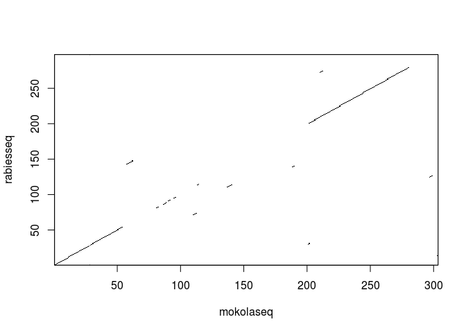
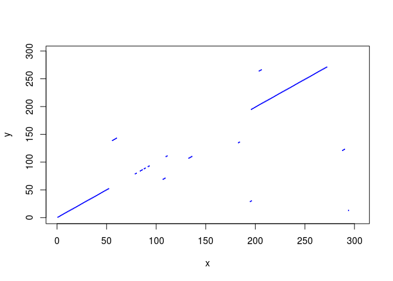
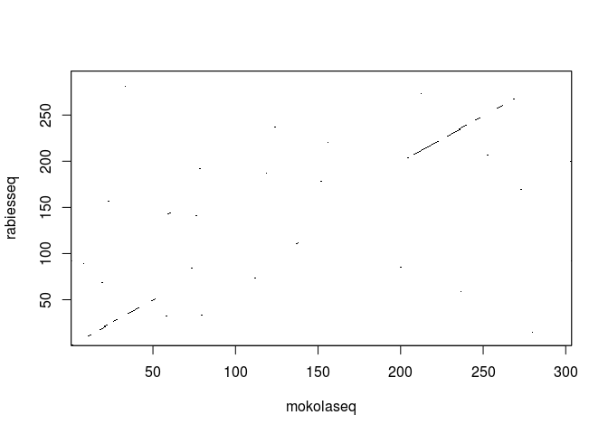
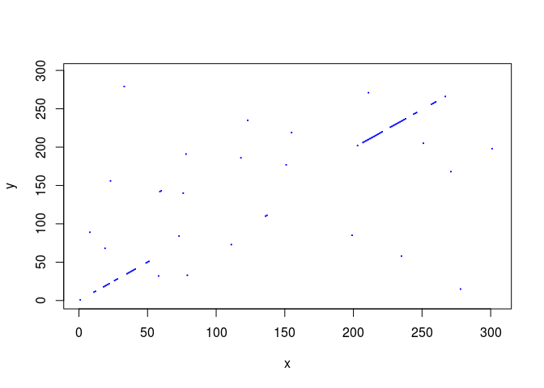

Revision Exercises 2
================

Q1. One of the key proteins produced by rabies virus is the rabies phosphoprotein (also known as rabies virus protein P). The UniProt accession for rabies virus phosphoprotein is P06747. The Mokola virus also produces a phosphoprotein, which has UniProt accession P0C569. Use the dotPlot() function in the SeqinR R package to make a dotplot of these two proteins, using a windowsize of 10 and threshold of 5. Are there any long regions of similarity between the two proteins (if so, where are they)?
===================================================================================================================================================================================================================================================================================================================================================================================================================================================================================================================

``` r
# how similar are these two proteins? P06747 vs. P0C569
# seqin r contains choosebank and getSequence 
library('seqinr')
# selecting the swissprot database. choosebank lets you select a database from ACNUC
choosebank('swissprot')
# the tutorial has this line without 'rabies <-' prepending it ... tutorial doesn't work
# it needs to be stored int his variable
rabies <- query("rabies", "AC=P06747")
# getSequence returns the sequence as a vector of single characters or a string of characters
rabiesseq <- getSequence(rabies$req[[1]])
mokola <- query("mokola", "AC=P0C569")
mokolaseq <- getSequence(mokola$req[[1]])
closebank()
dotPlot(mokolaseq,rabiesseq,wsize=10,nmatch=5)
```



``` r
# dotplot shows a region of similarity, which is not surprising because these 
# are both viruses that create a phosphoprotein
```

Q2. The function "makeDotPlot1()" below is an R function that makes a dotplot of two sequences by plotting a dot at every position where the two sequences share an identical letter. Use this function to make a dotplot of the rabies virus phosphoprotein and the Mokola virus phosphoprotein, setting the argument "dotsize" to 0.1 (this determines the radius of each dot plotted). Are there any long regions of similarity between the two proteins (if so, where are they)? Do you find the same regions as found in Q1, and if not, can you explain why?
==================================================================================================================================================================================================================================================================================================================================================================================================================================================================================================================================================================

``` r
# makeDotPlot1() Google search indicates that this function is *only* mentioned
# in this tutorial. This function also isn't mentioned at all in the last chapter.
# Maybe it's a defunct function? 
# makeDotPlot1(mokolaseq,rabiesseq,dotsize=0.1)
# I can't figure this one out. Gonna use the generic dotPlot function
# However, radius isn't an option. nmatch is an option, but that was used in Q1
# I doubled the window size and the # matches required to trigger
# not surprisingly, the regions that were shown to have similarity (prev figure)
# are still shown to have high similarity
dotPlot(mokolaseq,rabiesseq,wsize=20,nmatch=10)
```


``` r
# dotPlot(mokolaseq,rabiesseq,wsize=20,nmatch=5)
```

Q3. Adapt the R code in Q2 to write a function that makes a dotplot using a window of size x letters, where a dot is plotted in the first cell of the window if y or more letters compared in that window are identical in the two sequences.
=============================================================================================================================================================================================================================================

``` r
makeDotPlot3 <- function(seq1,seq2,windowsize,threshold,dotsize=1)
  {
     length1 <- length(seq1)
     length2 <- length(seq2)
     # make a plot:
     x <- 1
     y <- 1
     plot(x,y,ylim=c(1,length2),xlim=c(1,length1),col="white")
     for (i in 1:(length1-windowsize+1))
     {
        word1 <- seq1[i:(i+windowsize)]
        word1b <- c2s(word1)
        for (j in 1:(length2-windowsize+1))
        {
           word2 <- seq2[j:(j+windowsize)]
           word2b <- c2s(word2)
           # count how many identities there are:
           identities <- 0
           for (k in 1:windowsize)
           {
              letter1 <- seq1[(i+k-1)]
              letter2 <- seq2[(j+k-1)]
              if (letter1 == letter2)
              {
                 identities <- identities + 1
              }
           }
           if (identities >= threshold)
           {
              # add a point to the plot at the position
              for (k in 1:1)
              {
                 points(x=(i+k-1),(y=j+k-1),cex=dotsize,col="blue",pch=7)
              }
           }
        }
     }
     print(paste("FINISHED NOW"))
}
# well, this function works to answer question 2:
makeDotPlot3(mokolaseq,rabiesseq,10,5,0.1)
```



    ## [1] "FINISHED NOW"

Q4. Use the dotPlot() function in the SeqinR R package to make a dotplot of rabies virus phosphoprotein and Mokola virus phosphoprotein, using a window size of 3 and a threshold of 3. Use your own R function from Q3 to make a dotplot of rabies virus phosphoprotein and Mokola virus phosphoprotein, using a windowsize (x) of 3 and a threshold (y) of 3. Are the two plots similar or different, and can you explain why?
================================================================================================================================================================================================================================================================================================================================================================================================================================

``` r
# the two plots look the same (except for the color difference)
dotPlot(mokolaseq,rabiesseq,wsize=3,nmatch=3)
```



``` r
makeDotPlot3(mokolaseq,rabiesseq,windowsize=3,threshold=3,dotsize=0.1)
```



    ## [1] "FINISHED NOW"

Q5. Write an R function to calculate an unrooted phylogenetic tree with bootstraps, using the minimum evolution method (rather than the neighbour-joining method, which is used by the function unrootedNJtree).
================================================================================================================================================================================================================

``` r
# search for evolution methods with:
# help.search("evolution")
# using the unrootedNJtree to build a tree with minimal evolution
unrootedMEtree <- function(alignment,type)
  {
     # load the ape and seqinR packages:
     require("ape")
     require("seqinr")
     # define a function for making a tree:
     makemytree <- function(alignmentmat)
     {
        alignment <- ape::as.alignment(alignmentmat)
        if      (type == "protein")
        {
           mydist <- dist.alignment(alignment)
        }
        else if (type == "DNA")
        {
           alignmentbin <- as.DNAbin(alignment)
           mydist <- dist.dna(alignmentbin)
        }
        mytree <- fastme.bal(mydist)
        mytree <- makeLabel(mytree, space="") # get rid of spaces in tip names.
        return(mytree)
     }
     # infer a tree
     mymat  <- as.matrix.alignment(alignment)
     mytree <- makemytree(mymat)
     # bootstrap the tree
     myboot <- boot.phylo(mytree, mymat, makemytree)
     # plot the tree:
     plot.phylo(mytree,type="u")   # plot the unrooted phylogenetic tree
     nodelabels(myboot,cex=0.7)    # plot the bootstrap values
     mytree$node.label <- myboot   # make the bootstrap values be the node labels
     return(mytree)
  }
```
